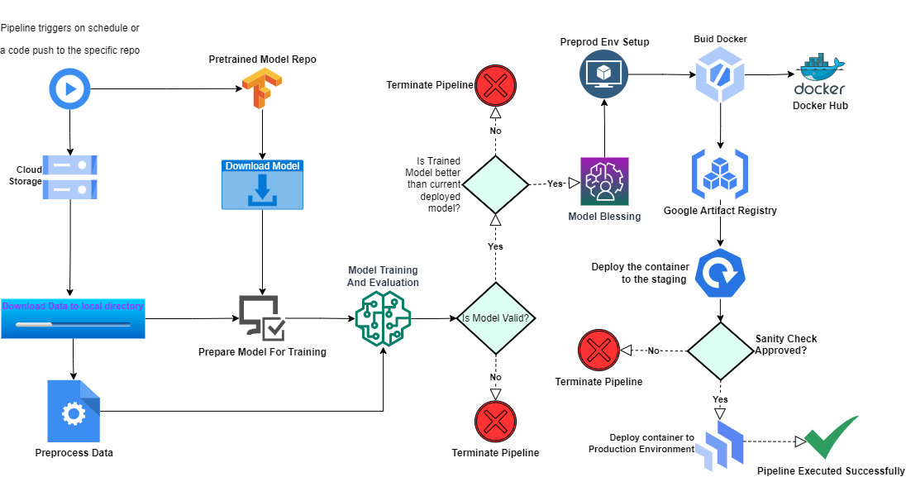
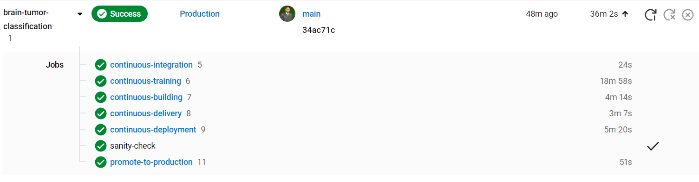
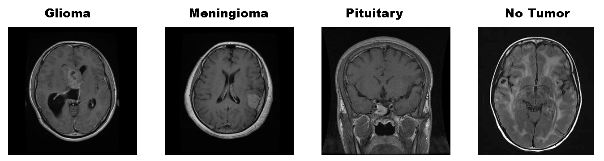

<p align="center">
    <b>
        <h1 align="center">Brain Tumor Classification</h1>
    </b>
</p>
<p align="center">
<a href="https://github.com/Hassi34/brain-tumor-classification">
    
</a>
</p>
<p align="center">
<a href="https://github.com/Hassi34/brain-tumor-classification">
    
</a>
</p>

<p align="center">
    <a href="https://www.python.org/downloads/">
        
    </a>
    <a href="https://github.com/Hassi34/brain-tumor-classification">
        
    </a>
    <a href="https://github.com/Hassi34/brain-tumor-classification">
        
    </a>
    <a href="https://github.com/Hassi34/brain-tumor-classification">
        
    </a>
    <a href="https://github.com/Hassi34/brain-tumor-classification">
        
    </a>
    <a href="https://github.com/Hassi34/brain-tumor-classification/blob/main/LICENSE">
        
    </a>
    <a href="https://github.com/hassi34/brain-tumor-classification/issues">
        
    </a>
    <a href="https://github.com/hassi34/brain-tumor-classification/issues">
        
    </a>
</p>

Following are the main contents to follow, you can jump to any section:

>   -  [Introduction](#project-intro)<br>
>   -  [Project Notebooks](https://github.com/Hassi34/brain-tumor-classification/tree/notebooks)
>   -  [Train Model Locally](#train-locally)<br>
>      - [Dataset details](#dataset-details)<br>
>      - [Results (Performance Metrics)](#results-)<br>
>   -  [Tech Stack](#tech-stack)<br>
>   -  [Infrastructure](#infra-)<br>
>   -  [DagsHub Data Pipeline](https://dagshub.com/hassi34/brain-tumor-classification)
>   -  [Run Locally](#run-local)<br>
>      - [Environment Setup](#env-setup)<br>
>      - [Environment Variables](#env-vars)<br>
>      - [Run Pipeline](#run-pipeline)<br>
>      - [REST API with Docker](rest-api)<br>
>        - [Pull Image from Docker Hub](#docker-container)<br>
>        - [Docker Container](#docker-container)<br>
>   -  [Conclusion](#conclusion-)<br>

### Introduction<a id='project-intro'></a>

Brain tumor detection is a critical task in the field of medical imaging, as it plays a crucial role in diagnosing and treating brain tumors, which can be life-threatening. With the advancement of machine learning and artificial intelligence (AI), vision AI has emerged as a promising approach for accurate and efficient brain tumor detection from medical images. In this project, we aim to develop a vision AI system for brain tumor detection using a level 2 MLOps (Machine Learning Operations) architecture, which includes a robust dvc (Data Version Control) pipeline and a Docker image for seamless production deployment.

MLOps, also known as DevOps for machine learning, is an iterative and collaborative approach that integrates machine learning models into the software development process, ensuring the reliability, scalability, and maintainability of ML models in production. Level 2 MLOps architecture focuses on advanced versioning and reproducibility, ensuring that the ML pipeline is well-documented and can be easily replicated in different environments.

The ultimate goal of our vision AI project is to develop a robust and scalable brain tumor detection system that can be easily deployed in production environments. By leveraging the level 2 MLOps architecture. It will help to minimize the healthcare operational cost and increase the effectiveness of the services by assisting the healthcare provider in accurate decision-making.

## Class Activation Map

## System Design


## CICD on Circleci

## DagsHub Data Pipeline
<br>
Complete Project Data Pipeline is available at [DagsHub Data Pipeline](https://dagshub.com/hassi34/brain-tumor-classification)


## Train Model Locally<a id='train-locally'></a>
<pre>
Dataset              : <a href=https://drive.google.com/drive/folders/1Pj61qQNfG1Ea7jTD8PK-COXc7MEHbfyo?usp=sharing>Brain Tumor MRI Dataset </a> 
Jupyter Notebooks    : <a href=https://github.com/Hassi34/brain-tumor-classification/tree/notebooks>Model Traninig Notebooks </a>                 
</pre>
The sample images of Glioma, Meningioma, Pituitary and Normal patients are shown in figure below:


#### Dataset Details<a id='dataset-details'></a>
<pre>
Dataset Name            : Brain Tumor MRI Dataset (Glioma vs Meningioma vs Pituitary vs Normal)
Number of Class         : 4
Number/Size of Images   : Total      : 7023 (151 MB)
                          Training   : 5712 
                          Testing    : 1311 
                         
</pre>
#### Results (Performance Metrics)<a id='results-'></a>
We have achieved following results with DenseNet121 model for detection of Glioma, Meningioma, Pituitary and Normal patients from Brain MRI images.

<pre>
<b> Performance Metrics </b>
Test Accuracy                                    : 98.9%
Precision                                        : 99.00%
Sensitivity (Glioma)                             : 100% 
Sensitivity (Meningioma)                         : 99% 
Sensitivity (Pituitary)                          : 100% 
Sensitivity (Normal)                             : 99% 
F1-score                                         : 99.00%
AUC                                              : 1.0
</pre>


## Tech Stack Used<a id='tech-stack'></a>
<pre>
1. Python 
2. Data Version Control (DVC) 
3. Docker
4. Machine learning algorithms
5. MLFlow
6. Cloud Computing
7. SMTP Server
</pre>
## Infrastructure<a id='infra-'></a>
<pre>
1. DockerHub
2. Google Cloud Storage (GCS)
3. Google Artifact Registry
4. GitHub
5. DaghsHub
6. CircleCI
7. Google App Engine
</pre>
## Run Locally<a id='run-local'></a>

* Ensure you have [Python 3.7+](https://www.python.org/downloads/) installed.

* Create a new Python Conda environment:<a id='env-setup'></a>

```bash
conda create -n venv python=3.10  
conda activate venv 
```
OR
* Create a new Python virtual environment with pip:
```bash
virtualenv venv
source venv/Scripts/activate
```
Install dependencies

```bash
  pip install -r requirements.txt
```

Clone the project

```bash
  git clone https://github.com/Hassi34/brain-tumor-classification.git
```

Go to the project directory

```bash
  cd brain-tumor-classification
```

#### Export the environment variable<a id='env-vars'></a>
```bash
# MLFlow
MLFLOW_TRACKING_URI=""
MLFLOW_TRACKING_USERNAME=""
MLFLOW_TRACKING_PASSWORD=""

#DockerHub 
DOCKERHUB_ACCESS_TOKEN=""
DOCKERHUB_USERNAME=""

#GCP
JSON_DCRYPT_KEY=""
GCLOUD_SERVICE_KEY=""
CLOUDSDK_CORE_PROJECT=""
GOOGLE_COMPUTE_REGION=""
GOOGLE_COMPUTE_ZONE=""

#Alerts
EMAIL_PASS=""
SERVER_EMAIL=""
EMAIL_RECIPIENTS=""

```

Run Pipeline<a id='run-pipeline'></a>

```bash
  dvc repro
```
## REST API with Docker<a id='rest-api'></a>
To run the following commands, ensure you have the docker installed on your system.

### Pull Image from Docker Hub<a id='docker-pull'></a>
In case you have not already pulled the image from the Docker Hub, you can use the following command:
```bash
docker pull hassi34/brain-tumor-classification
```

### Docker Container<a id='docker-container'></a>
Now once you have the docker image from the Docker Hub, you can now run the following commands to test and deploy the container to the web

* Run a Docker Container<a id='run-docker-container'></a><br>
Check all the available images:
```bash
docker images
```
Use the following command to run a docker container on your system:
```bash
docker run --name <CONTAINER NAME> -p 80:8080 -d <IMAGE NAME OR ID>
```
Check if the container is running:
```bash
docker ps
```
If the container is running, then the API services will be available on all the network interfaces<br>
To access the API service, type **``localhost``** in the browser.
## Conclusion<a id='conclusion-'></a>
This project is production ready for similar use cases and will provide the automated and orchestrated pipeline.
#### **👉🏻Thank you for visiting 🙏 Your feedback would be highly appreciated 💯😊**<br>
#### **👉🏻If you find this project useful then don't forget to star the repo ✨⭐🤖**<br>
#### 🌏[My Portfolio Website][website] <br><br>
#### **📃 License**
[MIT][license] © [Hasanain][website]

[license]: hhttps://github.com/Hassi34/brain-tumor-classification/blob/main/LICENSE
[website]: https://hasanain.aicaliber.com

Let's connect on **[``LinkedIn``](https://www.linkedin.com/in/hasanain-mehmood)** <br>